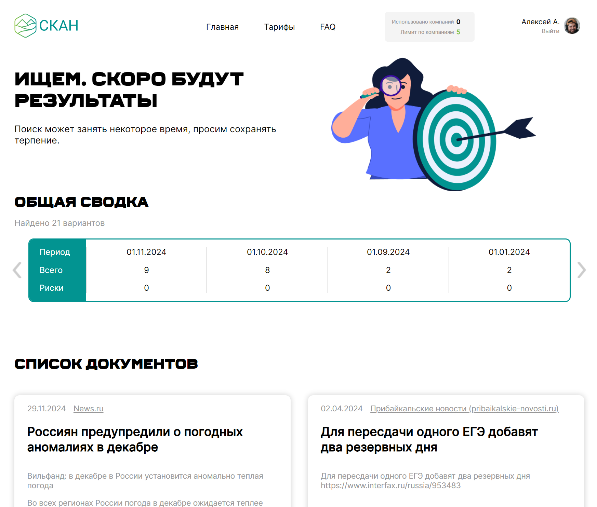

# Приложение для поиска публикаций о компании по ИНН

Фронтенд-часть сервиса получает данные через API и выводит результат. Имеется сервис аутентификации.

Макет: https://www.figma.com/file/u3MOjzYnTnirz712GrLbFv/Макет-СКАН

Сделан в качестве учебного проекта Skillfactory.

### Инструменты

- React + Vite
- axios, mobx, router, xml-parser
- HTML5, CSS, TS, sass, адаптив

### Как запустить development версию

- скачать архив с проектом, распаковать
- установить Node.js, npm, и другие модули (команда 'npm -i'). Обновить зависимости
- запуск: команда 'npm run start'
